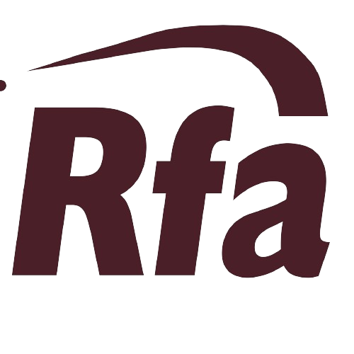

# Ranmal Fernando Associates (RFA)



## About RFA

Ranmal Fernando Associates (RFA) is a premier structural and civil engineering firm founded in February 2007 by Eng. Ranmal Fernando. With over 17 years of experience in the engineering industry, RFA has established itself as a trusted partner for comprehensive engineering solutions across Sri Lanka.

### Company Overview

- **Founded**: February 2007
- **Founder**: Eng. Ranmal Fernando (Principal Engineer)
- **Projects Completed**: 300+
- **Specialization**: Structural designs, project management, retrofitting works, and value engineering

### Our Mission

To deliver trusted structural engineering solutions, combining innovation, precision, and expertise to build lasting structures that serve communities for generations.

### Core Values

- **Excellence**: Commitment to high standards in design, execution, and supervision
- **Innovation**: Applying modern techniques and creative solutions to solve structural challenges
- **Client Focus**: Placing the needs and goals of our clients at the forefront of every project
- **Collaboration**: Working closely with clients, architects, MEP engineers, and quantity surveyors

### Certifications

- ISO 9001:2015 Quality Management
- Professional Engineers License
- LEED Accredited Professional
- Project Management Professional (PMP)
- Structural Engineering Certification

## Project Portfolio

Our extensive portfolio includes diverse sectors such as:

- Commercial buildings
- Mixed developments
- Housing schemes and apartments
- Hospitals and healthcare facilities
- Academic buildings
- Large-scale factories and industrial facilities
- Hotels and resorts
- Infrastructure projects

### Notable Projects

- **Maalu Maalu Resort & Spa** (2011) - Passekudah Bay
- **Sugar Factory Ethimale** (2024) - Siyambalanduwa
- **Kings Garden Residencies** (2020) - Colombo 5
- **The Blackpool Resort & Spa** - Nuwara Eliya
- **SWP Eco Lodge** (2018) - Kandy
- **Hotel Rajarata** - Anuradhapura

## Technology Stack

This website is built using modern web technologies:

### Frontend
- **React 18** - Modern JavaScript library for building user interfaces
- **TypeScript** - Type-safe JavaScript development
- **Tailwind CSS** - Utility-first CSS framework
- **React Router** - Client-side routing
- **Vite** - Fast build tool and development server

### UI Components
- **shadcn/ui** - Re-usable components built with Radix UI and Tailwind CSS
- **Lucide React** - Beautiful & consistent icon toolkit
- **Swiper** - Modern touch slider
- **Framer Motion** - Production-ready motion library for React

### Additional Libraries
- **EmailJS** - Email service for contact forms
- **React Hook Form** - Performant forms with easy validation
- **TanStack Query** - Powerful data synchronization for React
- **Sonner** - Opinionated toast component for React

## Getting Started

### Prerequisites

- Node.js (version 18 or higher)
- npm or yarn package manager

### Installation

1. **Clone the repository**
   ```bash
   git clone https://github.com/RavindiFernando/RFA.git
   cd RFA
   ```

2. **Install dependencies**
   ```bash
   npm install
   ```

3. **Start the development server**
   ```bash
   npm run dev
   ```

4. **Open your browser**
   Navigate to `http://localhost:5173` to view the application

### Available Scripts

- `npm run dev` - Start development server
- `npm run build` - Build for production
- `npm run build:dev` - Build in development mode
- `npm run preview` - Preview production build locally
- `npm run lint` - Run ESLint for code quality checks

## Project Structure

```
RFA/
├── public/                 # Static assets
│   ├── images/            # Image assets
│   └── favicon.ico        # Favicon
├── src/
│   ├── components/        # Reusable React components
│   │   ├── ui/           # shadcn/ui components
│   │   ├── Navigation.tsx # Main navigation component
│   │   ├── Footer.tsx    # Footer component
│   │   └── ...           # Other components
│   ├── pages/            # Page components
│   │   ├── Index.tsx     # Homepage
│   │   ├── About.tsx     # About us page
│   │   ├── Services.tsx  # Services page
│   │   ├── Projects.tsx  # Projects portfolio
│   │   ├── Contact.tsx   # Contact page
│   │   └── NotFound.tsx  # 404 page
│   ├── assets/           # Project images and media
│   ├── hooks/            # Custom React hooks
│   ├── lib/              # Utility functions
│   ├── App.tsx           # Main application component
│   └── main.tsx          # Application entry point
├── index.html            # HTML template
├── package.json          # Project dependencies and scripts
├── tailwind.config.ts    # Tailwind CSS configuration
├── tsconfig.json         # TypeScript configuration
└── vite.config.ts        # Vite configuration
```

## Features

### Homepage
- Interactive hero section with project showcase
- Company overview and statistics
- Featured services preview
- Call-to-action sections

### About Page
- Company history and founding story
- Founder profile and credentials
- Core values and mission
- Professional certifications
- Team expertise overview

### Services Page
- Comprehensive service offerings
- Detailed service descriptions
- Value propositions
- Process methodology

### Projects Page
- Portfolio showcase with project images
- Project details including location and year
- Filtering and categorization
- Project status indicators

### Contact Page
- Interactive contact form with EmailJS integration
- Company contact information
- Office location and hours
- Professional inquiry handling

## Deployment

### Production Build

```bash
npm run build
```

This creates an optimized production build in the `dist/` directory.

### Deployment Options

The built application can be deployed to various platforms:

- **Netlify**: Connect your GitHub repository for automatic deployments
- **Vercel**: Import project and deploy with zero configuration
- **GitHub Pages**: Use GitHub Actions for automated deployment
- **Traditional Web Hosting**: Upload the contents of `dist/` directory

### Environment Variables

For production deployment, ensure proper configuration of:
- EmailJS service credentials
- API endpoints (if any)
- Asset CDN URLs (if applicable)

## Contributing

We welcome contributions to improve the RFA website. Please follow these guidelines:

### Development Workflow

1. Fork the repository
2. Create a feature branch (`git checkout -b feature/amazing-feature`)
3. Make your changes
4. Run tests and linting (`npm run lint`)
5. Commit your changes (`git commit -m 'Add amazing feature'`)
6. Push to the branch (`git push origin feature/amazing-feature`)
7. Open a Pull Request

### Code Standards

- Follow TypeScript best practices
- Use ESLint configuration provided
- Maintain consistent code formatting
- Write meaningful commit messages
- Add appropriate comments for complex logic

### Testing

- Test all new features thoroughly
- Ensure responsive design works across devices
- Verify form functionality and email integration
- Check performance and accessibility

## Support & Contact

### Technical Support
For technical issues related to the website, please create an issue in this repository.

### Business Inquiries
For engineering services and project consultations:

- **Phone**: [Contact Number]
- **Email**: [Contact Email]
- **Website**: [Company Website]
- **Office**: [Office Address]

### Professional Services

Ranmal Fernando Associates offers:
- Structural design and analysis
- Project management and supervision
- Building retrofitting and rehabilitation
- Value engineering consultations
- Construction quality assurance
- Code compliance and safety assessments

## License

This project is proprietary software of Ranmal Fernando Associates. All rights reserved.

## Acknowledgments

- Built with modern web technologies for optimal performance
- Designed with user experience and accessibility in mind
- Optimized for search engines and mobile devices
- Follows industry best practices for web development

---

**Ranmal Fernando Associates** - *Building the Future with Engineering Excellence*

For more information about our engineering services, visit our website or contact us directly.